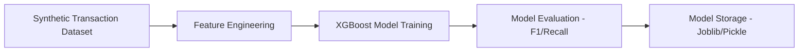
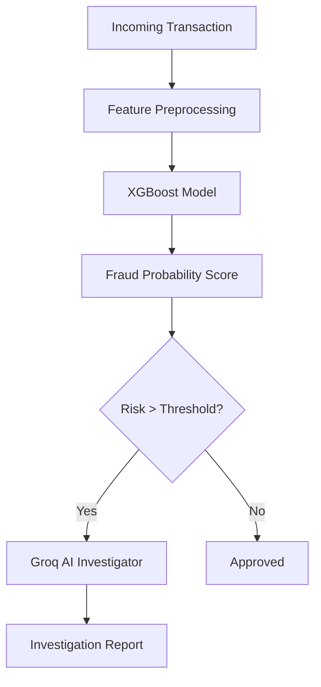
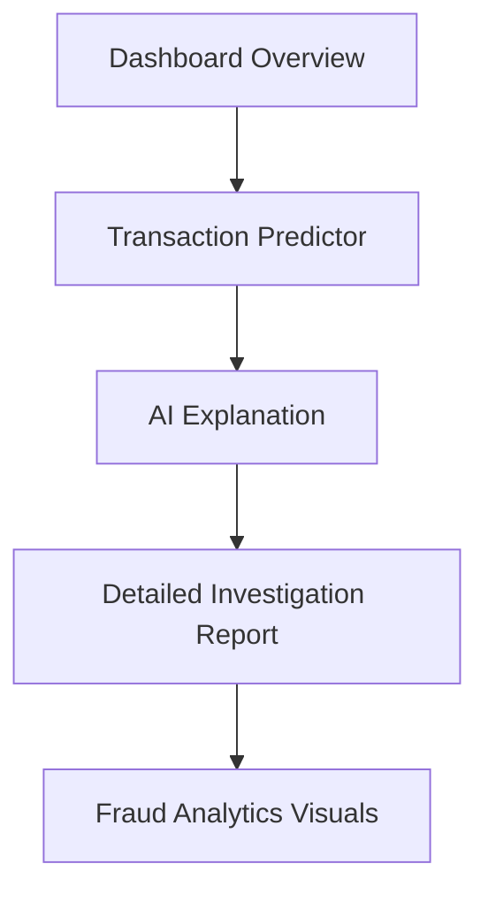

# AI-Powered Digital Wallet Fraud Investigator: Project Plan

## 1. Executive Summary
### Problem Statement
Digital wallet usage in Pakistan (Easypaisa, JazzCash, SadaPay) has exploded, but so has sophisticated financial fraud. Traditional rule-based systems often fail to catch complex patterns or generate too many false positives, leading to customer frustration and financial loss.

### Why Fraud Detection Matters
Fraud undermines trust in digital financial ecosystems. For fintech companies, detecting fraud isn't just about saving money; it's about regulatory compliance, brand reputation, and user retention.

### Digital Wallet Fraud in Pakistan
Pakistan's market is unique due to high mobile penetration, low financial literacy in some segments, and specific local fraud patterns like "SIM swapping" or social engineering (fake lottery calls).

### How AI Improves Detection
AI moves beyond static "if-then" rules. It identifies non-linear relationships, detects anomalies in real-time, and provides probabilistic risk scoring. By integrating LLMs (Groq), we can bridge the gap between "black-box" ML predictions and human-understandable investigations.

---

## 2. Product Vision
**"AI Fraud Investigator for Digital Wallet Transactions"**

### Target Users
*   **Fraud Analysts:** To accelerate investigation with AI-generated summaries.
*   **Risk Managers:** To monitor platform health via real-time analytics.
*   **Compliance Officers:** To maintain audit trails of suspicious activities.

### Business Value
*   **Efficiency:** Reduces the time to investigate a transaction from minutes to seconds.
*   **Accuracy:** Lowers false positives compared to traditional rule engines.
*   **Transparency:** Provides natural language explanations for every flagged transaction.

### Portfolio Value
This project demonstrates end-to-end expertise in:
*   Synthetic data engineering for niche markets.
*   Production-grade ML deployment.
*   Integrating Generative AI with traditional Predictive AI (Agentic Workflow).

---

## 3. System Architecture

### Training Pipeline


### Prediction Pipeline


### User Flow


### Architecture Explanation
The system uses a **Hybrid AI Approach**. A fast, lightweight **XGBoost** model handles the numerical prediction (speed/efficiency), while a **Groq-powered LLM** handles the cognitive task of reasoning and reporting (explainability). This ensures the system is both performant and transparent.

---

## 4. Technology Stack

| Component | Technology | Justification |
| :--- | :--- | :--- |
| **Frontend** | Streamlit | Rapid development, built-in support for data viz, free hosting. |
| **ML Framework** | XGBoost | Industry standard for tabular fraud data; handles imbalanced sets well. |
| **Data Handling** | Pandas / NumPy | Essential for feature engineering and matrix operations. |
| **Visualization** | Plotly | Interactive, professional-grade charts for the dashboard. |
| **LLM Provider** | Groq (Llama 3 70B) | Fastest inference, generous free tier, excellent reasoning. |
| **Deployment** | Streamlit Cloud | Zero-cost, seamless GitHub integration. |
| **Environment** | Python 3.10+ | Robust ecosystem for AI/ML. |

**Recommended Groq Model:** `llama3-70b-8192` – It offers the best balance of reasoning for complex fraud scenarios and high-speed response.

---

## 5. Dataset Strategy
Since no public Pakistani-specific dataset exists, we will generate a **Synthetic Dataset (30,000 transactions)**.

### Key Fields
*   `transaction_id`: Unique UUID.
*   `sender_id` / `receiver_id`: Mock Pakistani mobile numbers (e.g., 0300xxxxxxx).
*   `amount`: PKR 10 to 500,000.
*   `city`: Top 20 Pakistani cities (Karachi, Lahore, Islamabad, etc.).
*   `transaction_time`: 24-hour cycle.
*   `device_id`: Hash representing the mobile device.
*   `account_age_days`: Tenure of the user.
*   `transactions_today`: Velocity check.
*   `failed_login_attempts`: Security indicator.
*   `new_recipient`: Boolean (True if first time sending to this user).
*   `fraud_label`: 0 (Legit) or 1 (Fraud).

### Simulated Fraud Patterns
1.  **Velocity Attack:** 10+ transactions in < 5 minutes.
2.  **Night-Owl Fraud:** High-value transactions between 2 AM and 5 AM.
3.  **New Recipient Spike:** Large amount sent to a brand-new contact from an old account.
4.  **Device Switching:** Fraudulent login from a new `device_id` followed by immediate transfer.

---

## 6. Machine Learning Design

### Model Comparison
*   **Logistic Regression:** Too simple; fails on non-linear fraud patterns.
*   **Random Forest:** Good, but often slower and heavier than XGBoost.
*   **XGBoost (Winner):** Optimized for speed and performance on tabular data. Excellent at handling the extreme class imbalance typical in fraud (e.g., 99% legit, 1% fraud).

### Training Workflow
1.  Data Splitting (80/20 Train-Test).
2.  Handling Imbalance using `scale_pos_weight`.
3.  Hyperparameter tuning for Precision-Recall balance (Crucial for fraud).
4.  Saving the model as `fraud_model.pkl`.

---

## 7. Fraud Detection Rules (Feature Importance)
*   **Amount vs. Average:** Is the amount significantly higher than the user's 30-day average?
*   **Time of Day:** High weight on late-night transactions.
*   **Failed Logins:** Direct correlation with account takeover attempts.
*   **Location Mismatch:** User typically in Karachi sending from a Quetta-based IP/City.

---

## 8. AI Fraud Investigator

### Groq Prompt Template
```text
System: You are a Senior Fraud Investigator at a leading Pakistani Fintech. 
Analyze the following transaction data and ML risk score.

Context:
- Transaction Amount: {amount} PKR
- ML Fraud Probability: {prob}%
- Flagged Indicators: {indicators}
- Location: {city}
- Device: {device_id}

Task:
1. Explain why the ML model flagged this (Human-readable).
2. Assess the risk level (Low/Medium/High/Critical).
3. Recommend 3 immediate actions (e.g., Block account, Call customer, Request biometric).
4. Provide a 2-sentence summary for the management report.

Output Format: Professional Markdown.
```

### Example Output
> **Risk Assessment: CRITICAL**
> 
> **Reasoning:** This transaction was flagged due to a "Velocity Spike." The user attempted to send 50,000 PKR to a new recipient at 3:15 AM, shortly after 3 failed login attempts. This pattern strongly suggests an account takeover.
>
> **Recommended Actions:**
> 1. Temporarily suspend the account.
> 2. Trigger an automated SMS alert to the registered SIM.
> 3. Require Biometric Verification (NADRA) for the next login attempt.

---

## 9. Dashboard Design

### 1. Dashboard Overview
*   **KPI Tiles:** Total Volume, Fraud Rate, Active Alerts.
*   **Trend Line:** Daily fraud attempts.

### 2. Fraud Analytics
*   **Map:** Heatmap of fraud by city.
*   **Bar Chart:** Fraud distribution by hour.
*   **Pie Chart:** Common fraud triggers (e.g., 40% Velocity, 30% Night-time).

### 3. Transaction Predictor
*   **Form:** Input fields for Amount, City, New Recipient, etc.
*   **Button:** "Run Fraud Check".
*   **Output:** Gauge chart showing the Risk Score.

### 4. AI Investigator
*   **Auto-Trigger:** Runs when a prediction is > 50%.
*   **Display:** The Groq-generated Markdown report.

### 5. Model Performance
*   **Metrics:** Precision, Recall, F1-Score.
*   **Visuals:** Confusion Matrix and Feature Importance plot.

---

## 10. Project Structure
```text
AI_Fraud_Investigator/
├── app/
│   ├── main.py              # Streamlit Entry Point
│   ├── pages/               # Multi-page App logic
│   │   ├── 1_Analytics.py
│   │   ├── 2_Predictor.py
│   │   └── 3_Model_Metrics.py
├── data/
│   ├── generator.py         # Synthetic data script
│   └── transactions.csv     # Generated data
├── models/
│   ├── train.py             # Training script
│   └── fraud_model.pkl      # Saved XGBoost model
├── services/
│   ├── groq_client.py       # Groq API Integration
│   └── ml_service.py        # Prediction logic
├── utils/
│   └── helpers.py           # Formatting/Clean-up
├── .env                     # API Keys (Local)
├── requirements.txt         # Dependencies
└── README.md
```

---

## 11. Implementation Order
1.  **[H]** Write `generator.py` to create the synthetic dataset.
2.  **[H]** Train XGBoost model in `train.py` and save to `models/`.
3.  **[H]** Build basic Streamlit UI with `Predictor` page.
4.  **[M]** Integrate Groq API for the AI Investigator report.
5.  **[M]** Develop the `Analytics` dashboard with Plotly charts.
6.  **[L]** Final styling and deployment to Streamlit Cloud.

---

## 12. Streamlit Cloud Deployment
1.  Push code to GitHub.
2.  Connect GitHub repo to Streamlit Cloud.
3.  **Secrets:** Add `GROQ_API_KEY` in the Streamlit Cloud Dashboard (Secrets management).
4.  Ensure `requirements.txt` includes: `streamlit`, `xgboost`, `pandas`, `plotly`, `groq`, `scikit-learn`.

---

## 13. Portfolio Positioning

### Resume Description
"Developed an end-to-end AI Fraud Detection platform for Pakistani Digital Wallets. Integrated XGBoost for high-speed risk scoring and Groq (Llama 3) for automated investigation reporting. Reduced manual review time by simulating realistic fraud patterns and providing natural language explanations."

### GitHub Description
"🚀 AI-Powered Fraud Investigator for Fintech. Using ML + LLMs to detect and explain digital wallet fraud. Features a professional dashboard, real-time risk scoring, and AI-generated investigation reports. Tailored for the Pakistani market (Easypaisa/JazzCash patterns)."

### Elevator Pitch
"I built an AI Fraud Investigator that doesn't just flag suspicious transactions—it explains them. By combining XGBoost with Groq's LLM, the platform detects fraud patterns specific to Pakistani digital wallets and generates a full investigation report in seconds, all running on free-tier infrastructure."

---

## 14. Optional Stretch Features
*   **PDF Export:** Use `ReportLab` to download the AI Investigation report as a PDF.
*   **SHAP Plots:** Visualize feature contribution for the prediction.
*   **Feedback Loop:** A "Correct/Incorrect" button to simulate model re-training.

---

## 15. Final Recommendation
*   **Architecture:** Streamlit + XGBoost + Groq (Llama 3 70B).
*   **Dataset:** 30,000 synthetic rows with 12 features.
*   **Model:** XGBoost Classifier with `scale_pos_weight` for class imbalance.
*   **Deployment:** Streamlit Cloud for 24/7 availability at zero cost.
*   **Goal:** Focus on the "AI Investigator" as the Unique Selling Point (USP).
